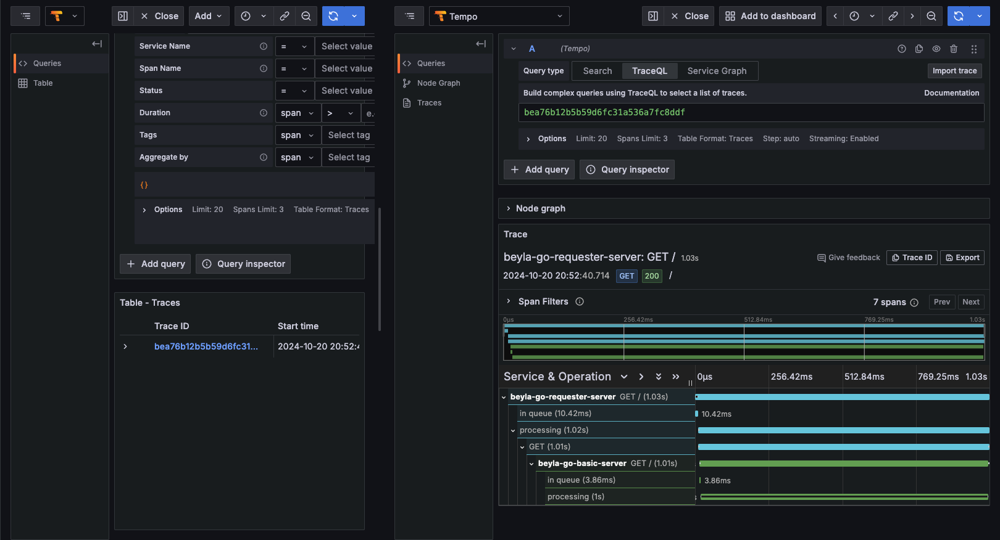

## go observability poc

POC to test the observability of a go application using [beyla](https://grafana.com/docs/beyla/latest/) an eBPF-based application auto-instrumentation tool.

## Installation

```bash
 docker-compose up
```

## Testing

```bash
curl -v "http://localhost:8081?force_delay=1000"
```

open grafana in your browser: localhost:3000
check for traces in tempo

eg for distributed tracing: 
